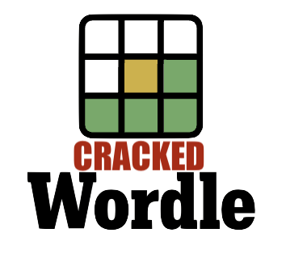

# lexgo

[](https://pypi.org/project/lexgo/)
[](https://github.com/joshkil/lexgo/releases)
[](https://github.com/joshkil/lexgo/actions/workflows/test.yml)
[](https://github.com/joshkil/lexgo/blob/master/LICENSE)

A lexicon search tool for language teachers and students. Explore word patterns in any language. 



Crack WORDLE in minutes using lexgo for hints. It's also great for cracking crossword puzzles. You can ask lexgo to find example words of specific lengths and with specific letters. 

## Installation

On Linux or Mac, things couldn't be simpler. Just open a terminal and follow these instructions. 

Install this tool using `pip`:
```bash
pip install lexgo
```
Python Package Index: https://pypi.org/project/lexgo/

If you aren't familiar with Python and have trouble with the install, you can read the python.org article [Using Python on Mac OSX](https://docs.python.org/3/using/mac.html). The article recommends an installer distributed by python.org. Personally, I like to use [Homebrew](https://brew.sh/) for installing applications on Mac, but [Anaconda](https://www.anaconda.com/download/) is also very popular. 

### Windows

You can use lexgo on Windows using the [Windows Subsystem for Linux](https://learn.microsoft.com/en-us/windows/wsl/install) inside the [Windows Terminal](https://learn.microsoft.com/en-us/windows/terminal/install). 

Here is a crash course: 

Search "Terminal" in your programs. Once the terminal is open, type these commands and follow the instructions you see in the terminal. 

```bash
wsl —install
sudo apt update
sudo apt upgrade
sudo apt install python3-pip
sudo apt install python3-venv
python3 -m venv ./venv
pip install lexgo
```

Now you are ready to use lexgo. Just type in your first command. 

```bash
# show all three letter words with 'a'
lexgo -i "a" "..."
```

After installing, when you want to use lexgo again in the future. Just open the terminal and type the following to get started. 

```bash
wsl
source ./venv/bin/activate
```

## Usage

For help, run:
```bash
lexgo --help
```
You can also use:
```bash
python -m lexgo --help
```
## Development

To contribute to this tool, first checkout the code. Then create a new virtual environment:
```bash
cd lexgo
python -m venv venv
source venv/bin/activate
```
Now install the dependencies and test dependencies:
```bash
pip install -e '.[test]'
```
To run the tests:
```bash
python -m pytest
```
## Acknowledgements

The English lexicon used was taken from the [english-words](https://github.com/dwyl/english-words) repo. Thanks to the esteemed programer [@dwyl](https://github.com/dwyl) for his excelent work. 

The Spanish lexicon used was taken from the [diccionario-español.txt](https://github.com/JorgeDuenasLerin/diccionario-espanol-txt) repo. Gracias al estimado programador [@JorgeDuenasLerin](https://github.com/JorgeDuenasLerin) por su trabajo excelente. 

The French lexicon used was taken from the [French-Dictionary](https://github.com/hbenbel/French-Dictionary) repo. Merci au programmeur estimé [@hbenbel](https://github.com/hbenbel) pour son excellent travail.

The Portuguese lexicon used was taken from the [words-pt](https://github.com/jfoclpf/words-pt) repo. Obrigado ao estimado programador [@jfoclpf](https://github.com/jfoclpf) por seu excelente trabalho.

The German lexicon used was taken from the [wortliste](https://github.com/davidak/wortliste) repo. Vielen Dank an den geschätzten Programmierer [@davidak](https://github.com/davidak) für seine hervorragende Arbeit.

The Italian lexicon used was taken from the [paroleitaliane](https://github.com/napolux/paroleitaliane) repo. Grazie allo stimato programmatore [@napolux](https://github.com/napolux) per il suo eccellente lavoro. This lexicon is in ascii and doesn't include any diacritical marks on the words. I'm searching for a better option. 

The python package chardet and the command line tool iconv were very helpful in detecting and converting encondings. 